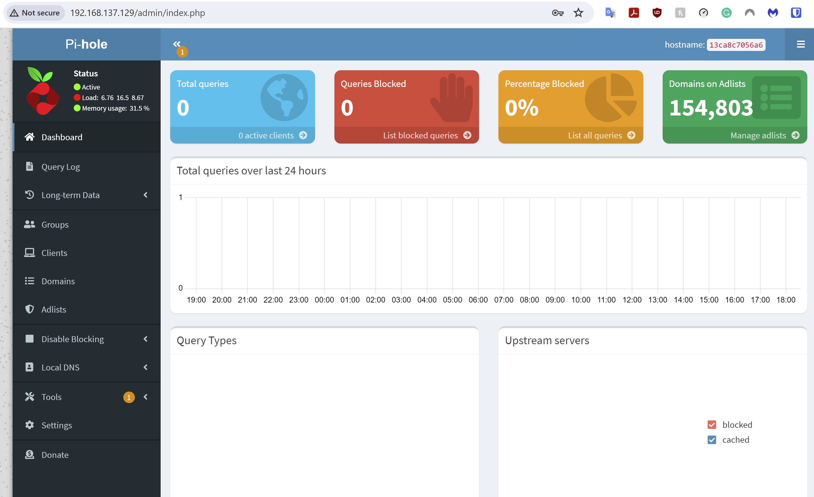

# Docker Installation Documentation
### By Josh Derr

## Step 1: Install Docker 
### We will be following the steps listed in the documentation listed [here](https://docs.docker.com/engine/install/ubuntu/)
1) The first step is to run "sudo apt update" on your ubuntu vm to update the package list for the repos configured in the system.
2) Next, you will want to uninstall the packages that will conflict with docker. Some of these packages include: docker.io, docker-compose, docker-compose-v2, docker-doc, and podman-docker. Run this command to uninstall all the conflicting packages: "for pkg in docker.io docker-doc docker-compose docker-compose-v2 podman-docker containerd runc; do sudo apt-get remove $pkg; done".
3) Now, install the Docker package with the apt repository. You will first run the command "\" in the linux terminal to switch into a script-friendly mode. Then use the code: 
```
# Add Docker's official GPG key:
sudo apt-get update
sudo apt-get install ca-certificates curl gnupg
sudo install -m 0755 -d /etc/apt/keyrings
curl -fsSL https://download.docker.com/linux/ubuntu/gpg | sudo gpg --dearmor -o /etc/apt/keyrings/docker.gpg
sudo chmod a+r /etc/apt/keyrings/docker.gpg

# Add the repository to Apt sources:
echo \
  "deb [arch="$(dpkg --print-architecture)" signed-by=/etc/apt/keyrings/docker.gpg] https://download.docker.com/linux/ubuntu \
  "$(. /etc/os-release && echo "$VERSION_CODENAME")" stable" | \
  sudo tee /etc/apt/sources.list.d/docker.list > /dev/null
sudo apt-get update
```

4) Once the previous commands finish, run the command "sudo apt-get install docker-ce docker-ce-cli containerd.io docker-buildx-plugin docker-compose-plugin" to install the latest version of Docker.

## Step 2: Downloading PiHole
### We will be following the steps listed in the documentation listed [here](https://github.com/pi-hole)
1) To start instlling PiHole, you will first want to run the command "wget https://raw.githubusercontent.com/pi-hole/docker-pi-hole/master/examples/docker-compose.yml.example -O docker-compose.yml". This command will download the file from the github url as docker-compose.yml. The code that will be downloaded is:

```
version: "3"

# https://github.com/pi-hole/docker-pi-hole/blob/master/README.md

services:
  pihole:
    container_name: pihole
    image: pihole/pihole:latest
    # For DHCP it is recommended to remove these ports and instead add: network_mode: "host"
    ports:
      - "53:53/tcp"
      - "53:53/udp"
      - "67:67/udp"
      - "80:80/tcp"
    environment:
      TZ: 'America/Chicago'
      # WEBPASSWORD: 'set a secure password here or it will be random'
    # Volumes store your data between container upgrades
    volumes:
      - './etc-pihole:/etc/pihole'
      - './etc-dnsmasq.d:/etc/dnsmasq.d'
    #   https://github.com/pi-hole/docker-pi-hole#note-on-capabilities
    cap_add:
      - NET_ADMIN
    restart: unless-stopped # Recommended but not required (DHCP needs NET_ADMIN)  
```

2) Once the file is saved, open it in nano with the command "nano docker-compose.yml".
3) Next, you will want to uncomment WEBPASSWORD and replace 'set a secure password here or it will be random' with your desired password.
4) You will also want to change the host number of the first two ports to be a number other than 53. They should resemble something like "54:53/tcp" and "54:53/udp".
5) Make sure to save and exit the nano file.
6) You will then run the command "sudo docker compose up -d" to start the containers defined in detached mode.
### Shown below is a picture of the PiHole web ui on my host device
