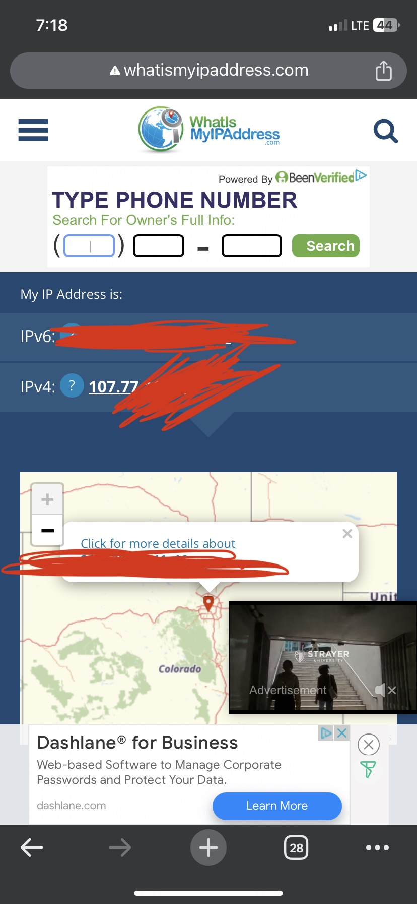
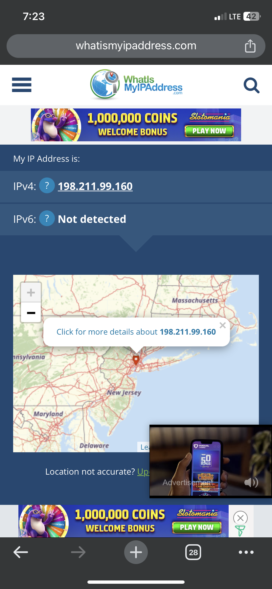
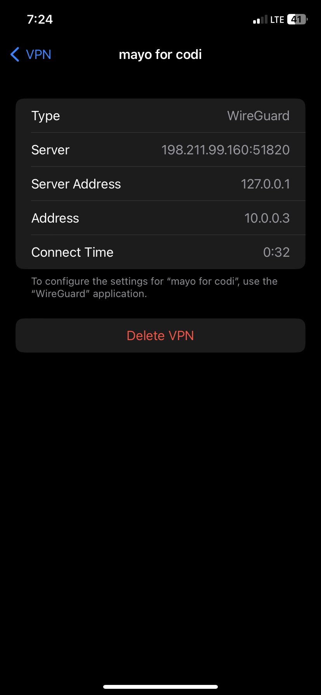
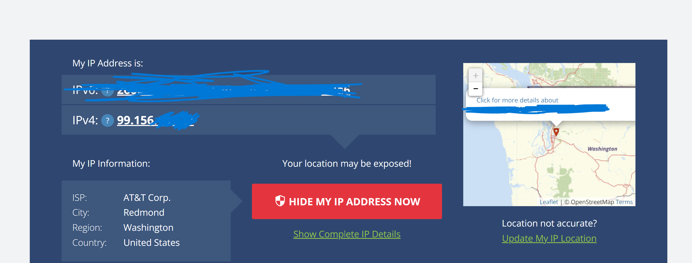
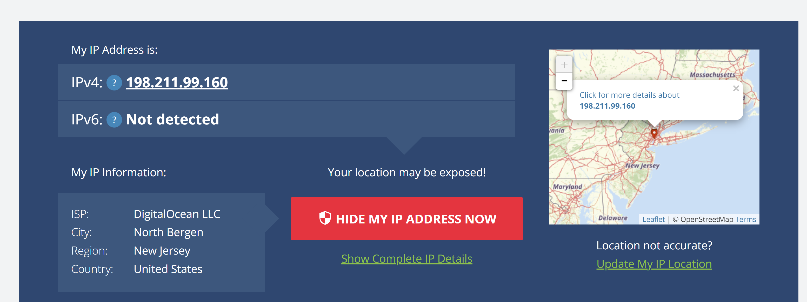
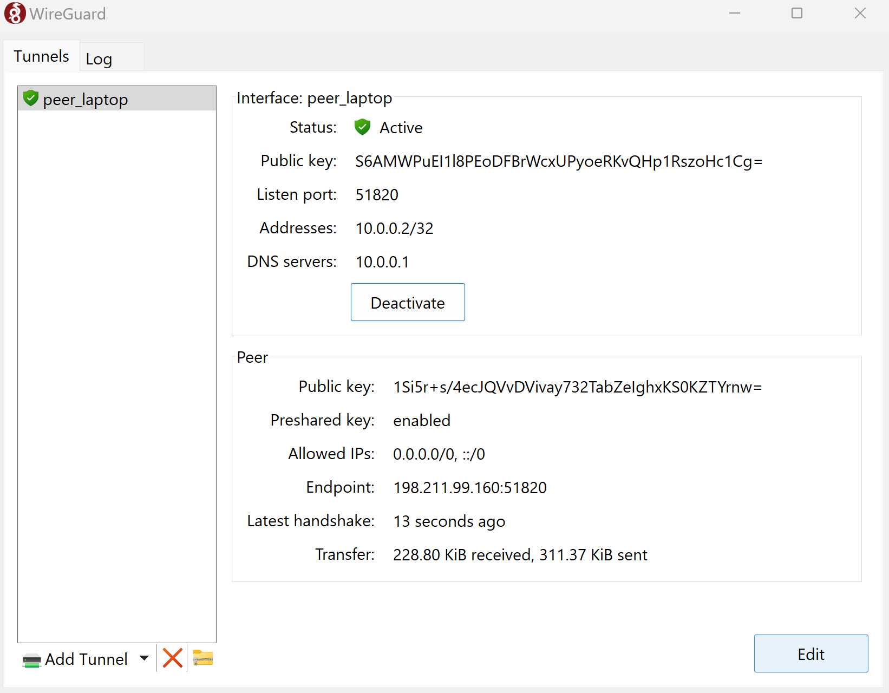

# Docker Installation Documentation
### By Josh Derr

## Prerequisites
- This project requires a digital ocean account, $5 (This may or may not be refunded 👀👀👀), a ubuntu droplet, and docker on the droplet.   
- [Digital Ocean Account Registration](https://m.do.co/c/4d7f4ff9cfe4)
- [Docker Installation Instructions](https://thematrix.dev/setup-wireguard-vpn-server-with-docker/)

## Step 1: Install Wireguard
### We will be following the steps listed in the documentation listed [here](https://github.com/linuxserver/docker-wireguard)
1) Run the commands below to create the necessary directories and write to the docker-compose.yml file:
~~~
mkdir -p ~/wireguard/
mkdir -p ~/wireguard/config/
nano ~/wireguard/docker-compose.yml
~~~
2) Once inside the docker-compose.yml file, paste the code below:
~~~
version: '2.1'
services: 
    wireguard:
        container_name: wireguard
        image: linuxserver/wireguard
        environment:
            - PUID=1000
            - PGID=1000
            - TZ=America/Chicago
            - SERVERURL=68.183.48.11
            - SERVERPORT=51820
            - PEERS=laptop,phone,pc
            - PEERDNS=auto
            - INTERNAL_SUBNET=10.0.0.0
        ports:
            - 51820:51820/udp
        volumes:
            - type: bind
            source: ./config/
            target: /config/
            - type: bind
            source: /lib/modules
            target: /lib/modules
        restart: always
        cap_add:
            - NET_ADMIN
            - SYS_MODULE
        sysctls:
            - net.ipv4.conf.all.src_valid_mark=1
~~~
3) To change the timezone of your VM to that of Oklahoma, use the following command
~~~
sudo timedatectl set-timezone America/Chicago
~~~
4) Next, you will want to configure the SERVERURL on your digital ocean server to that of the P address found on the digital ocean control panel. Do this by nano-ing into your docker-compose.yml file and changing the IP.
5) Now you will change the PEERS variable to the number of config fles you want to connect to your VPN. Each device will require a unique name.

## Step 2: Starting the WireGuard VPN
1) To start running WireGuard, use the following code:
~~~
cd ~/wireguard/
docker-compose up -d
~~~ 
2) In order to find the exe log and QR code to connect to the VPN on the WireGuard app, use the following command while wireguard is running:
~~~
docker-compose logs -f wireguard
~~~

## Images

